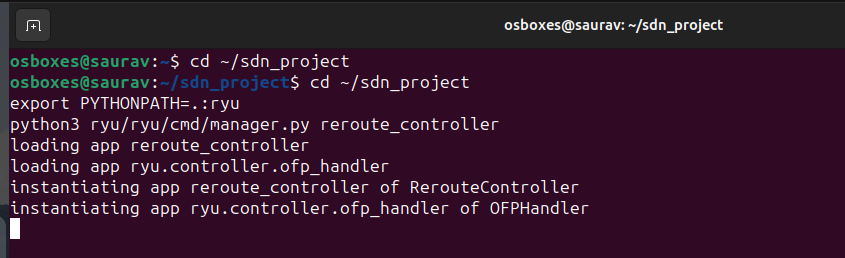
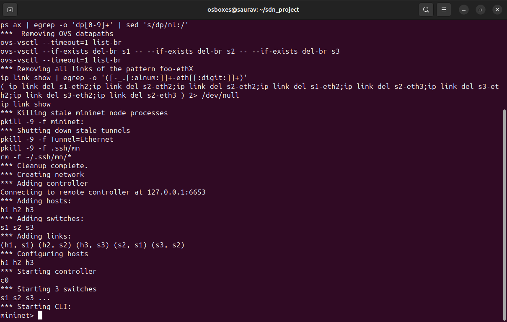
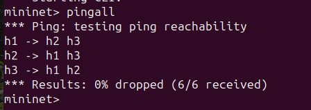
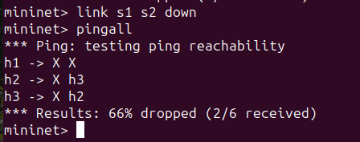
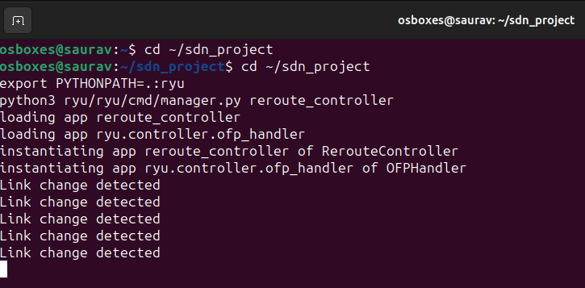
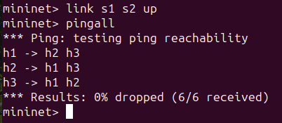
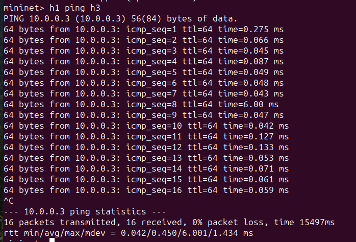
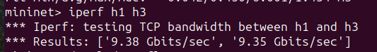
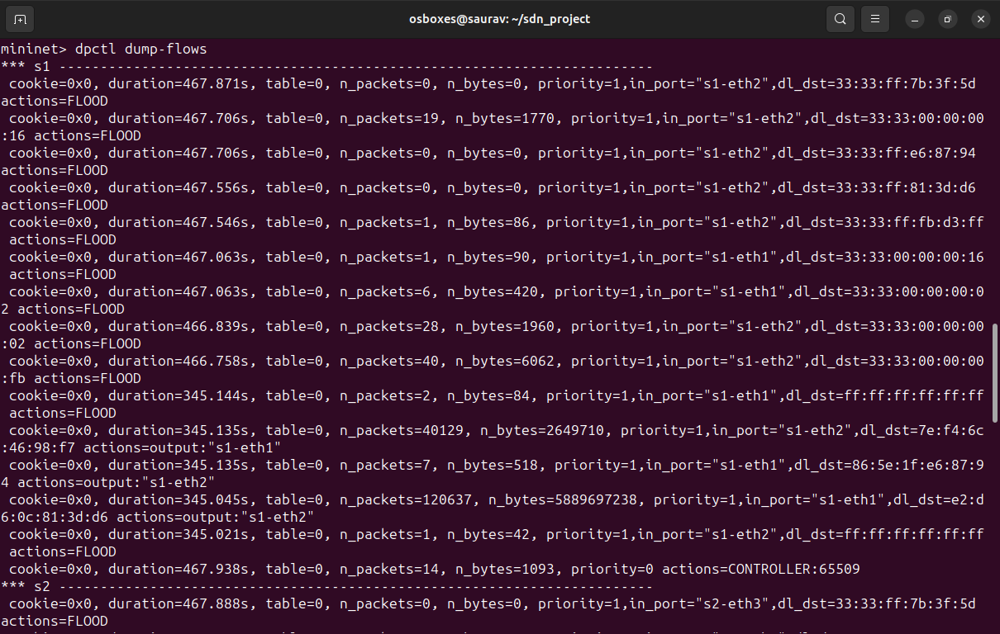

# Link Failure Detection and Recovery

## Problem Statement

The aim of this project is to detect link failures in a network and update routing dynamically using Software Defined Networking (SDN). The controller continuously monitors topology changes, detects when a link goes down, updates flow rules accordingly, and ensures that network connectivity is maintained or restored.

---

## Setup / Execution Steps

Step 1: Open terminal and navigate to the project folder  
cd ~/sdn_project  

Step 2: Start the Ryu controller  
cd ryu  
export PYTHONPATH=$(pwd)  
python3 ryu/cmd/manager.py ../reroute_controller  

Step 3: Open a new terminal and clean Mininet  
sudo mn -c  

Step 4: Start the Mininet topology  
sudo mn --topo linear,3 --controller=remote  

Step 5: Verify normal network operation  
pingall  

Step 6: Simulate link failure  
link s1 s2 down  
pingall  

Step 7: Restore the link  
link s1 s2 up  
pingall  

Step 8: Perform latency test  
h1 ping h3  

Step 9: Perform throughput test  
iperf h1 h3  

---

## Expected Output

- Under normal conditions, all hosts communicate successfully with 0% packet loss using pingall.  
- When the link between switches s1 and s2 is brought down, packet loss is observed, indicating network failure.  
- The controller detects the link failure and logs the event in the terminal.  
- After restoring the link, connectivity is re-established and pingall shows successful communication again.  
- Latency and throughput tests show degraded performance during failure and normal performance after recovery.  

---

## Proof of Execution

### 1. Controller Initialization
The Ryu controller starts successfully and waits for network events.

---

### 2. Mininet Topology Setup
The Mininet network is initialized with switches and hosts.

---

### 3. Normal Network Operation
All hosts communicate successfully with no packet loss.

---

### 4. Link Failure Scenario
When the link between switches is brought down, packet loss is observed.

---

### 5. Controller Detecting Link Failure
The controller detects the link change and logs the event.

---

### 6. Link Recovery
After restoring the link, communication is re-established.

---

### 7. Latency Test
Ping is used to measure latency between hosts.

---

### 8. Throughput Test
iperf is used to measure network throughput.

---

### 9. Flow Table Entries
Flow rules installed by the controller are displayed.

## References

- Ryu SDN Framework Documentation: https://ryu.readthedocs.io/  
- Mininet Documentation: http://mininet.org/documentation/  
- OpenFlow Protocol Overview: https://opennetworking.org/  
